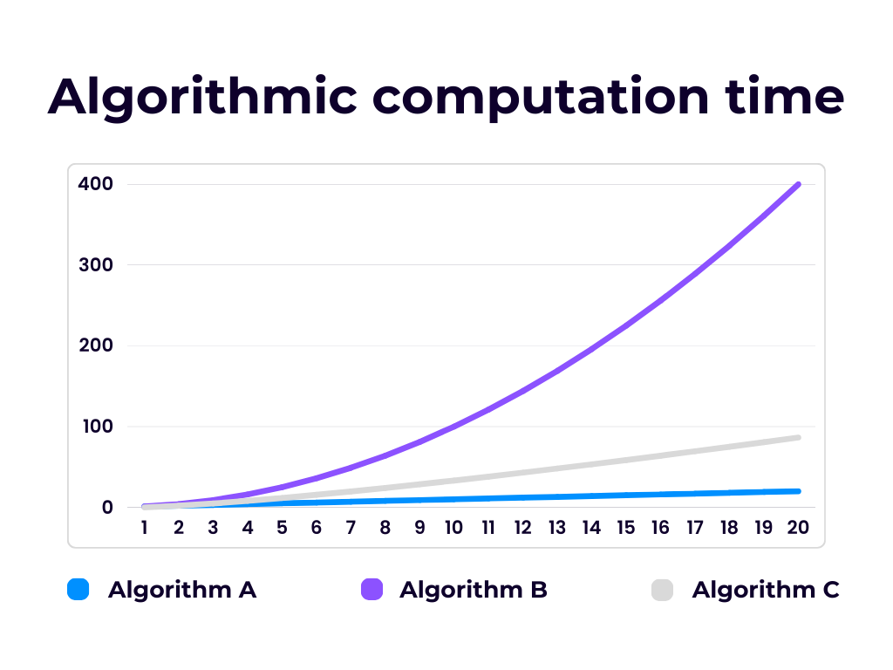
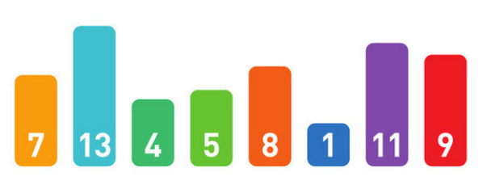

# プログラミング実習

## 第4回：アルゴリズム

清水 哲也（ shimizu@info.shonan-it.ac.jp ）

---

# 今回の授業内容

- [前回の課題の解答例](#前回の授業課題と宿題の解答例)
- [アルゴリズム](#アルゴリズム)
  - [ソートアルゴリズムについて](#ソートアルゴリズムについて)
  - [バブルソート](#バブルソート)
  - [選択ソート](#選択ソート)
  - [挿入ソート](#挿入ソート)
- [課題の提出方法について](#課題の提出方法について)
- [課題](#課題-1)

---

# 前回の授業課題と宿題の解答例

---

# 前回の授業課題と宿題の解答例

SAの学生さんによる解答例です．
https://shimizu-lab.notion.site/2024-11826a533567807390dcfa0a5e288e15?pvs=4

---

# アルゴリズム

---

# アルゴリズムとは

「アルゴリズム」とは，計算や作業を遂行するための手順のことです．
良く料理のレシピと例えられますが，アルゴリズムはすべての手順が数学的に記述され，あいまいさがありません．
アルゴリズムとプログラムのはっきりとした境目はありません．同じアルゴリズムでも，プログラミング言語が違えば違うプログラムになりますし，たとえ同じプログラミング言語を使っても，プログラムする人により違うプログラムになります．

---

# アルゴリズムの評価基準

同じ問題を解くアルゴリズムは一つとは限りません．例えば，並び替え（ソート）の問題を解くためのアルゴリズムは簡単なものでも数種類あります．どのアルゴリズムを使えばいいのか？アルゴリズムの評価基準は？と疑問に思うこともあると思います．
実際いろんな基準があります．
- 人間にとて理解し易い
- 記憶領域の使用量
- メモリの使用量
- etc.
一般的に最も重要視されるているのは**計算回数**です．
すなわち，入力を与えてから答えを出すまでの時間のことです．

---

# 計算時間の測り方

## 入力の大きさと計算時間の関係をつかむ

アルゴリズムによる計算時間の違いもありますが，同じアルゴリズムでも入力の大きさによっても変わります．
その変化によってアルゴリズムの計算時間がどのくらい変わるのかをつかむことも重要になります．
例えば，ソートアルゴリズムで10個のソートと20個のソートでも入力の大きさと計算時間の変化はアルゴリズムによって違いがあります．
次のスライドにそのイメージ図を示します．

---

---

# 計算時間の求め方

## Q.計算時間の変化度合いをどのように測ればよいか？

プログラムを書いてコンピュータ上で実行して実際にかかった時間を計測するのが最も現実的です．しかし，コンピュータのスペックによる違いがでるのでどのスペックを基準にすればいいかわからない．

計算時間には「 **ステップ数** 」が用いられます．

**1ステップ** = アルゴリズム内で実行される基本的な演算や命令の実行を指します．

---

# 計算時間の求め方

例として以下のソートアルゴリズムの計算時間を理論的に求めてみます．

1. 数列から最小値を探す
2. 最小値を数列の左端の数字と交換し，ソート済みとする．1.に戻る

数列の中の数字の個数を $n$ とします．1.の「最小値を探す」プロセスは，$n$ 個の数字をチェックすれば終わります．ここで，「1つの数字をチェックする」操作を1ステップとします．1ステップにかかる時間を $T_c$ とすると，1.の操作は $n \times T_c$ 時間で終わります．

「2つの数字を交換する」という操作も1ステップとして，$T_s$ 時間かかるとします．2.のプロセスでは $n$ によらず交換を1回だけ行いますので，$T_s$ 時間で終わります．

1.と2.は $n$ 回繰り返し，1回のラウンドドトにチェックする数が1つずつ減っていくので，合計の計算時間は以下のようになります．
$$
\frac{1}{2} T_c n^2 +(\frac{1}{2} T_c + T_s) n
$$

---

# 計算時間の表し方

例のソートアルゴリズムの計算時間を再度掲載します．
$$
\frac{1}{2} T_c n^2 +(\frac{1}{2} T_c + T_s) n
$$
この式の中で $T_c, T_s$ は入力と無関係です．入力により変わるのは数列の長さ $n$ です．
上の式で，$n$ を大きくしていった場合，第1項と第2項では第1項の方が大きくなり，第2項は相対的に小さくなります．
この式では，最も大きな影響を与える部分は $n^2$ だることがわかります．なので，他の部分を削除して以下のように表現します．

$$
\frac{1}{2} T_c n^2 +(\frac{1}{2} T_c + T_s) n = O(n^2)
$$

これによって例のソートアルゴリズムの実行時間は，大雑把に入力の数列の大きさ $n$ の2乗に比例して変わることがわかりました．

---

# 計算時間の表し方

別のソートアルゴリズムの計算時間が
$$
5 T_x n^3 12 T_y n^2 + 3T_z n
$$
の場合は，$O(n^3)$ と表すことができます．
また，別のソートアルゴリズムの計算時間が
$$
3n \log n + 2 T_y n
$$
なら，$O(n \log n)$ と表現できます．

ここで，$O$ は「重要な項以外は無視する」という意味を込めた記号で，「 **オーダー** 」と呼びます．
$O(n^2)$ は「計算時間は最悪 $n^2$ の定数倍に抑えられる」ということを意味します．
※厳密な定義は他の授業でやります．

---

# ソートアルゴリズムについて

ソートとは，入力として与えられた数字を小さい順に並べ帰ることです．日本語では，「整列」といいます．ここでは各数字を棒で表し，数字の大きさをその棒の高さで表すことにします．

このような入力が与えられたばあい，左から小さい順に並べ替えることが目標です．
10個ぐらいの数字なら，人間が手作業でも簡単にソートできますが，データ数が10,000ともなると大変です．そこで，効率の良いアルゴリズムを使うことが重要になります．

---

# バブルソート

バブルソートでは，「右から左に向かって，隣り合う2つの数字を比較して入れ替える」という操作を繰り返し行います．
右から左に数字が移動して行く様子が，水中の泡が受け上がって行く様子ににていることから，こう名付けられました．

<dvi Align=center>

PDFの場合，GIFアニメーションが再生されないので元のアニメーションです．
https://en.wikipedia.org/wiki/Bubble_sort#/media/File:Bubble-sort-example-300px.gif

---

# 選択ソート

選択ソートでは，「数列の中から最小値を探索し，左端の数字と入れ替える」という操作を繰り返します．数列の中から最小値を探す際に，線形探索を行っています．

</dvi>
PDFの場合，GIFアニメーションが再生されないので元のアニメーションです．
https://en.wikipedia.org/wiki/Selection_sort#/media/File:Selection-Sort-Animation.gif

---

# 挿入ソート

挿入ソートは，数列の左側から順番にソートしていくイメージです．途中の段階では，左側からだんだんとソート済みになり，右側にはまだ見ていない数字が残ります．右側の未探索領域から数字を1つ取ってきて，ソート済みの領域の適正な場所に挿入していきます．

PDFの場合，GIFアニメーションが再生されないので元のアニメーションです．
https://en.wikipedia.org/wiki/Insertion_sort#/media/File:Insertion-sort-example-300px.gif

---

# 課題

</dvi>

---

# 課題の提出方法について

これまではWordファイルに解答プログラムを貼り付けて提出していましたが，これからは1問ずつMoodleにプログラムファイルを提出することにします．

---

# 課題

- 課題はMoodle上の[課題04-1](https://moodle2024.shonan-it.ac.jp/mod/assign/view.php?id=38440), [課題04-2](https://moodle2024.shonan-it.ac.jp/mod/assign/view.php?id=38442) にあります
- 課題に書かれている問題に解答するプログラムを作成してください
- 作成したプログラムを実行して問題なく動作しているかを確認してください
- 動作確認が終わったら，プログラムファイル（*filename*.c）をMoodleに提出してください

### 提出期限は **10月14日(月) 20:00** まで