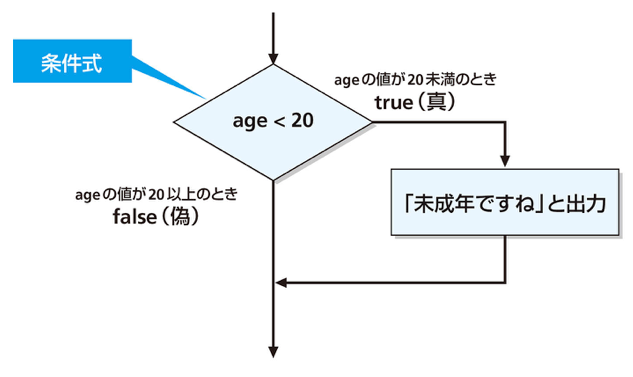
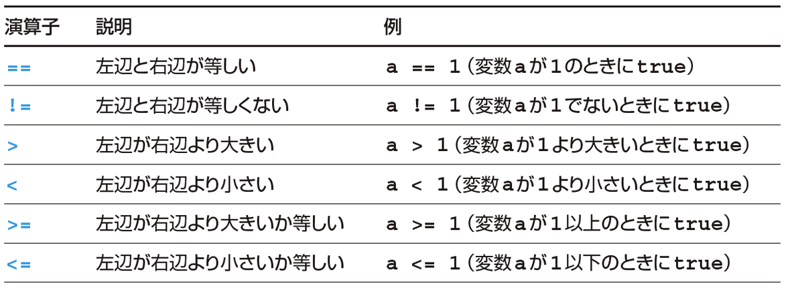
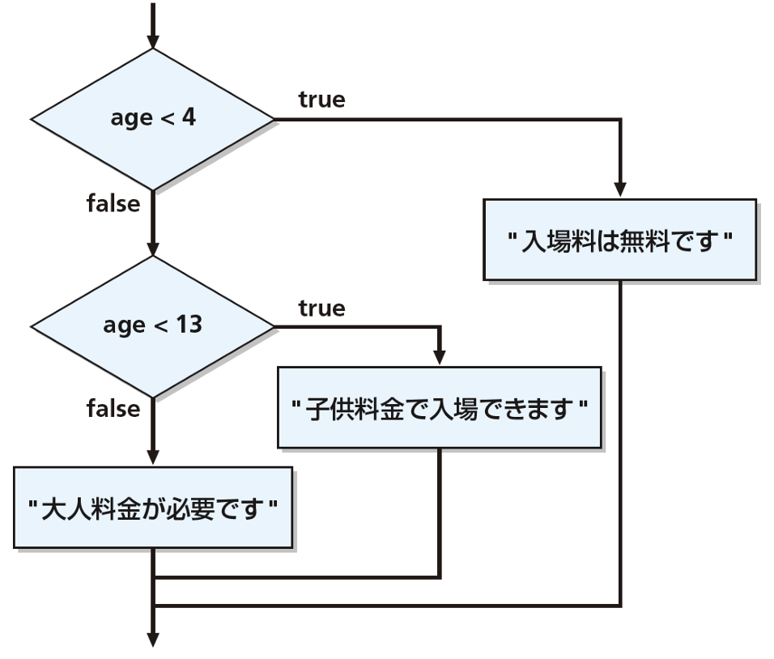
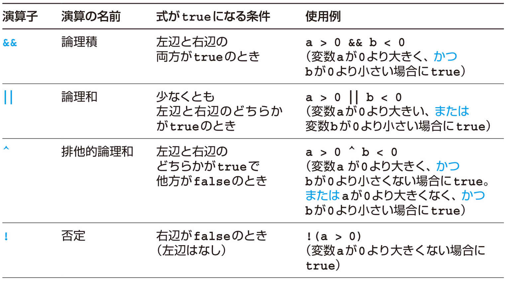
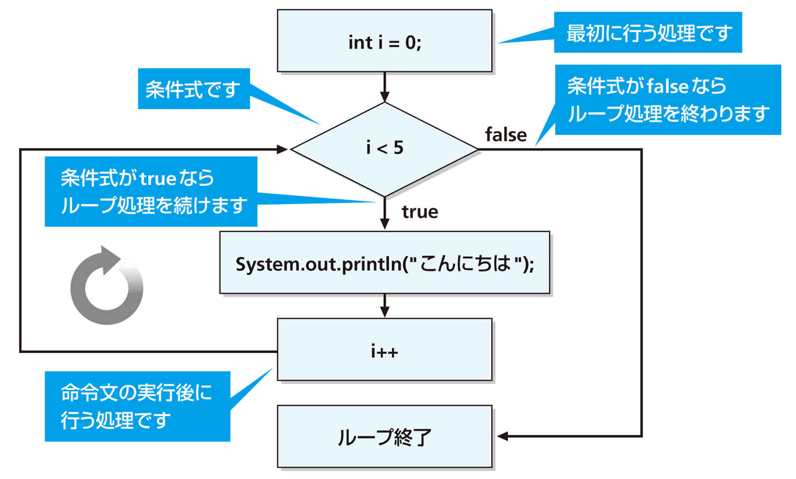

# プログラミング実習

## 第5回：Javaの設定

清水 哲也（ shimizu@info.shonan-it.ac.jp ）

---

# 今回の授業内容

- [前回の課題の解答例](#前回の課題の解答例)
- [VSCodeでJavaの開発環境を整える](#vscodeでjavaの開発環境を整える)
- [条件分岐](#条件分岐)
- [繰り返し](#繰り返し)
- [課題](#課題)

---

<div Align=center>

# 前回の課題の解答例

</div>

---

# 前回の課題の解答例

SAの学生さんによる解答例です．
https://shimizu-lab.notion.site/2024-11826a533567807390dcfa0a5e288e15?pvs=4

---

<div Align=center>

# VSCodeでJavaの開発環境を整える

</div>

---

# VSCodeでJavaの開発環境を整える

以下のサイトの手順がまとめられています

（URLをあとで貼り付ける）


---

<div Align=center>

# 条件分岐

</div>

---

# 条件分岐

条件による処理の分岐
「もしも◯◯ならば✗✗を実行する」

```Java
if(◯◯) {
    ✗✗;
}
```
構文として書くと
```Java
if(条件式) {
    命令文;   // 条件式がtureの場合に実行される
}
```

---

# 条件分岐の例

```Java
if(age < 18) {
    System.out.purintln("未成年ですね");
}
```

<div Align=center>



</div>

---

# 関係演算子
- 関係演算子を使って，2つの値を比較できる
- 比較した結果は `true` または `false` になる

<div Align=center>



</div>

---

# if 〜 else 文
「もしも◯◯ならば✗✗を実行し，そうでなければ△△を実行する」

```Java
if(条件式) {
    // 条件式がtrueの場合
    命令文1;
} else {
    // 条件式がfalseの場合
    命令文2;
}
```

---

# if 〜 else文の使用例

```Java
int age;
age = 18;

if(age < 18) {
    System.out.println("未成年ですね");
} else {
    System.out.println("投票に行きましょう");
}
```

---

# 複数のif 〜 else文
if 〜 else文を連結して，条件に応じた複数の分岐を行える

```Java
int age;
age = 18;

if(age < 4) {
    System.out.println("入場料は無料です");
} else if(age < 13) {
    System.out.println("子供料金で入場できます");
} else {
  System.out.println("大人料金が必要です");
}
```

---

# 複数のif 〜 else文

<div Align=center>



</div>

---

# if文の後の`{ }`の省略

if文の後の命令文が1つなら，`{ }` を省略できます
次の2つは同じ結果になります

```Java
if(age >= 20)
    System.out.purintln("二十歳以上ですね");
```

```Java
if(age >= 20) {
    System.out.purintln("二十歳以上ですね");
}
```
### 重要：命令文が2つ以上の場合は省略できません

---

# switch文
式の値によって処理を切り替えます．break文でブロックを抜けます．

<div Align=center>


</div>

---

# switch文の例(1)
```Java
switch(score){
  case 1:
    System.out.println("もっと頑張りましょう");
    break;
  case 2:
    System.out.println("もう少し頑張りましょう");
    break;
  case 3:
    System.out.println("普通です");
    break;
  case 4:
    System.out.println("よくできました");
    break;
  case 5:
    System.out.println("大変よくできました");
    break;
  default:
    System.out.println("想定されていない点数です");
    break;
}
System.out.println("switchブロックを抜けました");
```

---

# switch文の例(2)
```Java
switch(score){
  case 1:
  case 2:
    System.out.println("もっと頑張りましょう");
    break;
  case 3:
  case 4:
  case 5:
    System.out.println("合格です");
    break;
  default:
    System.out.println("想定されていない点数です");
    break;
}
```

---

# 論理演算子

論理演算子を使って複数の条件式を組み合わせられる

<div Align=center>



</div>

---

# 論理演算子の例

「ageが13以上」かつ「ageが65未満」

```Java
age >= 13 && age < 65
```

「ageが13未満」または「ageが65以上」

```Java
age < 13 || age >= 65
```

「ageが13以上」かつ「ageが65未満」かつ「20でない」

```Java
age >= 13 && age < 65 && age != 20
```

---

# 演算子の優先度

算術演算子が関係演算子より優先される

` a + 10 > b * 5` = ` (a + 10) > (b * 5)`

関係演算子が論理演算子より優先される

` a > 10 && b < 3` = ` (a > 10) && (b < 3)`

カッコの付け方で論理演算の結果が異なる

` x && ( y || z)` $\neq$ ` (x && y) || z`

---

<div Align=center>

# 繰り返し

</dvi>

---

# 処理の繰り返し

- ある処理を繰り返し実行したいことがよくあります
- ループ構文を使用すると，繰り返し処理を簡単に記述できます
- Javaには3つのループ構文があります
  - `for`文
  - `while`文
  - `do` 〜 `while`文

---

# for文の構文

for文の構文

```Java
for(最初の処理; 条件式; 命令文の後に行う処理) {
  命令文
}
```

1. 「最初の処理」を行う
2. 「条件式」が `ture` なら「命令文」を行う，`false` ならfor文を終了する
3. 「命令文の後に行う処理」を行う
4. 2.に戻る

---

# for文の例

```Java
for(int i = 0; i < 5; i++) {
  System.out.println("こんにちは");
}
```

<div Align=center>



</div>

---

# `for`ループ文で変数を使う

forループ内で変数を使用することで，例えば1から100までを足し合わせる計算ができる

```Java
int sum = 0;

for(int i = 1; i <=100; i++) {
  sum += i;
  System.out.println(i + "を加えます");
}

System.out.println("合計は" + sum);
```

---

# while文

while文

```Java
while(条件式) {
  命令文
}
```

1. 「条件式」が `true` なら「命令文」を行う，`false` ならwhile文を終了する
2. 1.に戻る

※for文と同じ繰り返し命令を書ける

---

# while文の例

```Java
int i = 0;

while(i < 5) {
  System.out.println("こんにちは");
  i++; // この命令文が無いと「無限ループ」になります
}
```

```Java
int i = 5;

while(i > 0) {
  System.out.println(i);
  i--; // この命令文が無いと「無限ループ」になります
}
```

---

# do 〜 while文
do 〜 while文の構文

```Java
do {
  命令文
} while(条件式);
```

1. 「命令文」を実行する
2. 「条件式」が `ture` なら1.に戻る．`false` ならdo〜while文を終了する

※for文，while文と同じ繰り返し命令を書ける

---

# do 〜 while文

```Java
int i = 0;

do {
  System.out.println("こんにちは");
  i++;
} while(i < 5);
```

```Java
int i = 5;

do {
  System.out.println(i);
  i--;
} while(i > 0);
```

---

# ループの処理を中断する「break」

`break;` でループ処理を強制終了できる

```Java
int sum = 0;

for(int i = 1; i <= 10; i++) {
  sum += i;
  System.out.println(i + "を加えました");
  if(sum > 20) {
    System.out.println("合計が20を超えた");
    breake;
  }
}

System.out.println("合計は" + sum);
```

---

# ループ内の処理をスキップする「continue」

`contiinue;` でブロック内の残りの命令文をスキップできる

```Java
int sum = 0;

for(int i = 1; i <= 10; i++) {
  if(i % 2 == 0) {
    continue;
  }
  sum += i;
  System.out.println(i + "を加えました");
}

System.out.println("合計は" + sum);
```
---

<div Align=center>

# 課題

</dvi>

---

# 課題

- 課題はMoodle上の[課題04-1](https://moodle2024.shonan-it.ac.jp/mod/assign/view.php?id=38440), [課題04-2](https://moodle2024.shonan-it.ac.jp/mod/assign/view.php?id=38442) にあります
- 課題に書かれている問題に解答するプログラムを作成してください
- 作成したプログラムを実行して問題なく動作しているかを確認してください
- 動作確認が終わったら，プログラムファイル（*filename*.c）をMoodleに提出してください

### 提出期限は **10月21日(月) 20:00** まで