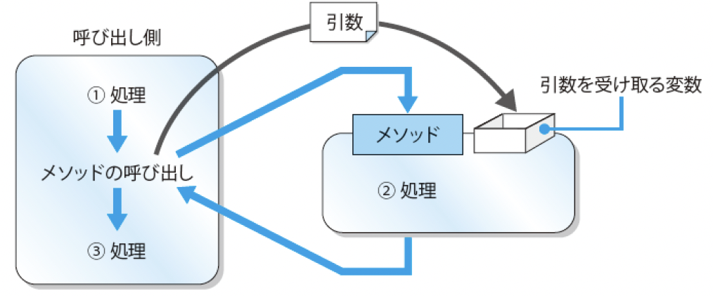
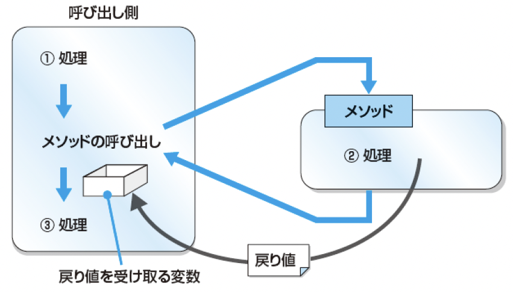

# プログラミング実習

## 第6回：Javaの設定，条件分岐，繰り返し

清水 哲也（ shimizu@info.shonan-it.ac.jp ）

---

# 今回の授業内容

- [前回の課題の解答例](#前回の課題の解答例)
- [メソッド](#メソッド)
- [メソッドのオーバーロード](#メソッドのオーバーロード)
- [課題](#課題)

---

<div Align=center>

# 前回の課題の解答例

</div>

---

# 前回の課題の解答例

SAの学生さんによる解答例です．
https://shimizu-lab.notion.site/2024-11826a533567807390dcfa0a5e288e15?pvs=4

---

<div Align=center>

# メソッド

</div>

---

# メソッドとは

- 長いプログラムが必要になるときは，命令文を分けて管理した方が見通しが良くなる
- メソッドは複数の命令文をまとめたもの

### メソッドの宣言
```java
void メソッド名() {
  命令文
}
```

- メソッド名は自由につけることができますが， **先頭の文字は小文字** にするという習慣があります
- 「メソッド」には「クラスメソッド」と「インスタンスメソッド」の2種類があり，今回はクラスメソッドについて学びます

---

# メソッドの例
メソッドを持つクラスの例

```java
public class Example {
  public static void countdonw() {
    System.out.println("カウントダウンをします");
    for(int i = 5; i >= 0; i--) {
      System.out.println(i);
    }
  }

  public static void main(String[] args) {
    countdown();
  }
}
```

例の中の `countdown()` がメソッド名となります．そして，`main` で `countdown();` をメソッドを呼出しています

---

# main メソッド

```java
public static void main(String[] args)
```

- Javaでは，プログラムが実行されるときに，この `main` メソッドがJava仮想マシンから呼び出されます
- `main` メソッドは，プログラムの開始位置となる **特別なメソッド** です
- `main` メソッドがないとプログラムは動きません


---

# メソッド呼出しの処理の流れ

<div Align=center>


</div>

---

# メソッドの記述場所

C言語と異なりJava言語ではメソッドの宣言位置はmainメソッドより後でも問題ないです

```java
public class Example{
  public static void methodA() {
    System.out.println("methodAが呼び出されました");
  }

  public static void main(String[] args) {
    methodA();
    methodB();
  }

  public static void methodB(){
    System.out.println("methodBが呼び出されました");
  }
}
```

---

# メソッド呼出しの階層

```java
public class Example{
  public static void methodA() { methodB(); }

  public static void methodB() {
    System.out.println("MethodAに呼び出されたMethodB");
  }

  public static void main(String[] args) { methodA(); }
}
```

<div Align=center>


</div>

---

# メソッドの引数と戻り値

メソッドは命令文のセット

### 引数
- メソッドには，命令を実行するときに値を渡すことができます
- この値を「**引数**」と呼びます
### 戻り値
- メソッドは，命令を実行した結果の値を呼び出しもとに戻すことができます
- この値を「**戻り値**」と呼びます


---

# 引数のあるメソッド

<div Align=center>



</div>

```java
void メソッド名(型 変数名) {
  命令文
}
```

---

# 引数のあるメソッドの例
引数の受渡しには，メソッド名の後ろのカッコ `()` を使用する

```java
class Example {
  public static void countdown(int start) {
    System.out.println("メソッドが受け取った値:" + start);
    System.out.println("カウントダウンをします");
    for(int i = start; i >= 0; i--) {
      System.out.println(i);
    }
  }
  public static void main(String[] args) throws Exception {
    countdown(10);
  }
}
```

---

# 複数の引数のあるメソッドの例

複数の引数を指定できる

```java
class Example {
  public static void countdown(int start, int end) {
    System.out.println("1つ目の引数で受け取った値：" + start);
    System.out.println("2つ目の引数で受け取った値：" + end);
    System.out.println("カウントダウンをします");
    for (int i = start; i >= end; i--){
      System.out.println(i);
    }
  }
  public static void main(String[] args) throws Exception {
    countdown(7 ,3);
  }
}
```

---

# キーボード入力

キーボード入力を使う場合は， `java.util.Scanner`　を使う

```java
import java.util.Scanner;

public class Example {
  public static void main(String[] args) {
    Scanner in = new Scanner(System.in);
    System.out.println("整数を入力してください．");
    int i = in.nextInt();
    System.out.println(i + "が入力されました．");
  }
}
```

小数を受け取る場合は `nextInt` のかわりに `nextDouble` ，文字列を受け取る場合は `next` を使います．

---

# 戻り値のあるメソッド

<div Align=center>



</div>

```java
public static 戻り値の型 メソッド名(引数列) {
  命令文
  return 戻り値;
}
```

---

# 戻り値のあるメソッドの例1

- `return` を使って値を戻すようにする
- 戻り値は1つだけ
- 戻り値の型をメソッド名の前に書く

```java
public static double getAreaOfCircle(double radius) {
  return radius * radius * 3.14;
}
```

このメソッド名は`getAreaOfCircle`とし，引数も戻り値も`double`型です．
引数`radius`を受け取り円の面積（半径ｘ半径ｘ3.14）を計算した結果を返します．

---

# 戻り値のあるメソッドの例1

`getAreaOfCircle`メソッドの戻り値の型が`double`型なので`main`メソッドで受け取る変数も`double`型で宣言します．

```java
class Example {
  public static double getAreaofCircle(double radius) {
    return radius * radius * 3.14;
  }

  public static void main(String[] args) {
    double circleArea = getAreaofCircle(2.5);
    System.out.println("半径2.5の円の面積は" + circleArea);
  }
}
```

---

# 戻り値のあるメソッドの例2

`boolean`型の値を戻り値にするメソッドの例です．
`isPositiveNumber`メソッドは，引数で受け取った値が「正の値」であれば`true`をそうでなれば`false`を返します

```java
public static boolean isPositiveNumber(int i) {
  if(i > 0) {
    return true;
  } else {
    return false;
  }
}
```

この例でもわかるように，`return`を複数使うこともできます．ですが，`if`文などを利用して条件分岐をする必要があります．

---

# 戻り値のあるメソッドの例2

```java
class Example {
  public static boolean isPositiveNumber(int i) {
    if(i > 0) {
      return true;
    } else {
      return false;
    }
  }
  public static void main(String[] args) {
    int i = -10;
    if(isPositiveNumber(i) == true) {
      System.out.println("iの値は正です");
    } else {
      System.out.println("iの値は負またはゼロです");
    }
  }
}
```

---

# メソッドのまとめ

引数，戻り値なし

```java
void メソッド名() {
  命令文
}
```

引数あり，戻り値なし

```java
void メソッド名(型 変数名) {
  命令文
}
```

引数，戻り値あり

```java
戻り値の型 メソッド名(型 変数名) {
  命令文
  return 戻り値;
}
```
---

<div Align=center>

# メソッドのオーバーロード

</div>

---

# メソッドのオーバーロードとは？

### 定義
同じクラス内で，同じ名前のメソッドを異なる引数リストで複数定義することです

### 目的
同じ機能を提供しつつ，**引数の型**や**数**の違いに対応するためです

### 特徴
- メソッド名が同じ
- 引数の型、数、順序が異なる
- 戻り値の型だけを変えてもオーバーロードにはならない

----

# メソッドのオーバーロードとは？

### オーバーロードの条件

1. **引数の数**が異なる
2. **引数の型**が異なる
3. **引数の並び順**が異なる（異なる型の引数の場合）

### メソッドのオーバーロード例
```java
public int add(int a, int b)
public double add(double a, double b)
public int add(int a, int b, int c)
```

---

# オーバーロードのメリットとデメリット

### メリット

- **コードの可読性向上** : 同じ機能に対して統一されたメソッド名を使用できる
- **柔軟性** : 引数の違いに応じてメソッドを使い分けることが可能
- **開発効率の向上** : メソッド名を覚える負担が減る

### デメリット

- **可読性の低下** : 過度なオーバーロードはコードの理解を難しくする
- **デバッグの難易度上昇** : どのメソッドが呼び出されているか判別しづらい
- **保守性の低下** : メソッドが増えると管理が複雑になる

---

# メソッドのオーバーロードの例

```java
class Example {
  public static void methodA() {
    System.out.println("引数はありません");
  }
  public static void methodA(int i) {
    System.out.println("int型の値" + i + "を受け取りました．");
  }
  public static void methodA(double d) {
    System.out.println("double型の値" + d + "を受け取りました．");
  }
  public static void methodA(String s) {
    System.out.println("文字列" + s + "を受け取りました．");
  }
  public static void main(String[] args) {
    methodA();
    methodA(1);
    methodA(0.1);
    methodA("Hello");
  }
}
```

---

# オーバーロードができない場合

- 変数の名前が異なるだけではオーバーロードできません

```java
public static void methodA(int i) { 略 }
public static void methodA(int j) { 略 }
```

- 戻り値の方が異なるだけではオーバーロードできません． 

```java
public static void methodA(int i) { 略 }
public static int methodA(int i) { 略 }
```

- メソッドの区別する際の要素は，「**メソッド名**」「**引数の型**」「**引数の数**」の3つになります．

---

# シグネチャ

- 「**メソッド名**」「**引数の型**」「**引数の数**」の3つの要素を **シグネチャ** と呼びます
- シグネチャが同じメソッドを宣言することはできません

---

<div Align=center>

# 課題

</dvi>

---

# 課題

- 課題はMoodle上にあります
- 課題に書かれている問題に解答するプログラムを作成してください
- 作成したプログラムを実行して問題なく動作しているかを確認してください
- 動作確認が終わったら，プログラムファイル（`filename.java`）をMoodleに提出してください

### 提出期限は **11月4日(月) 20:00** まで