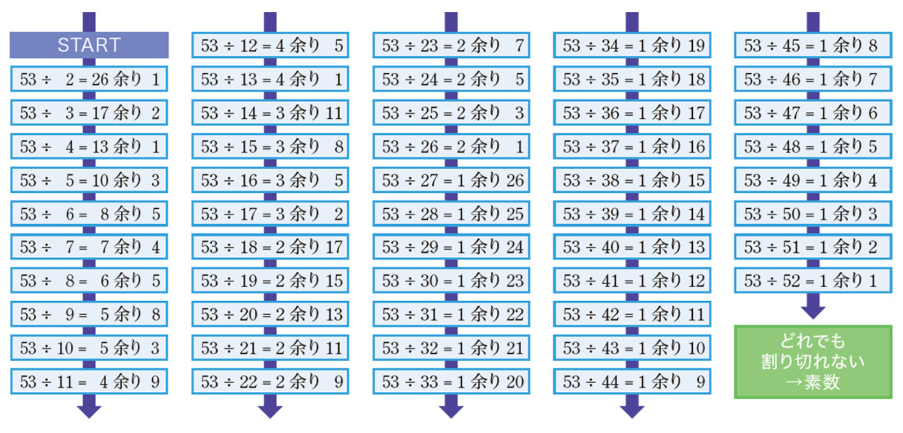
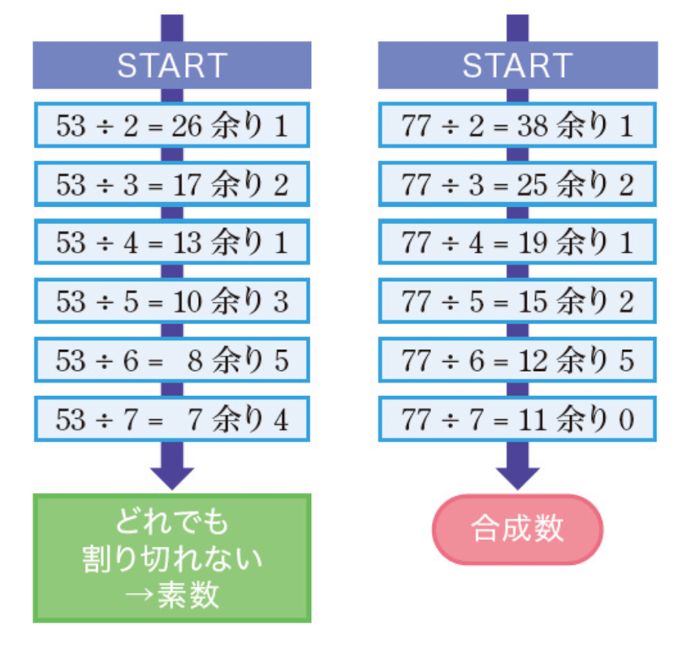
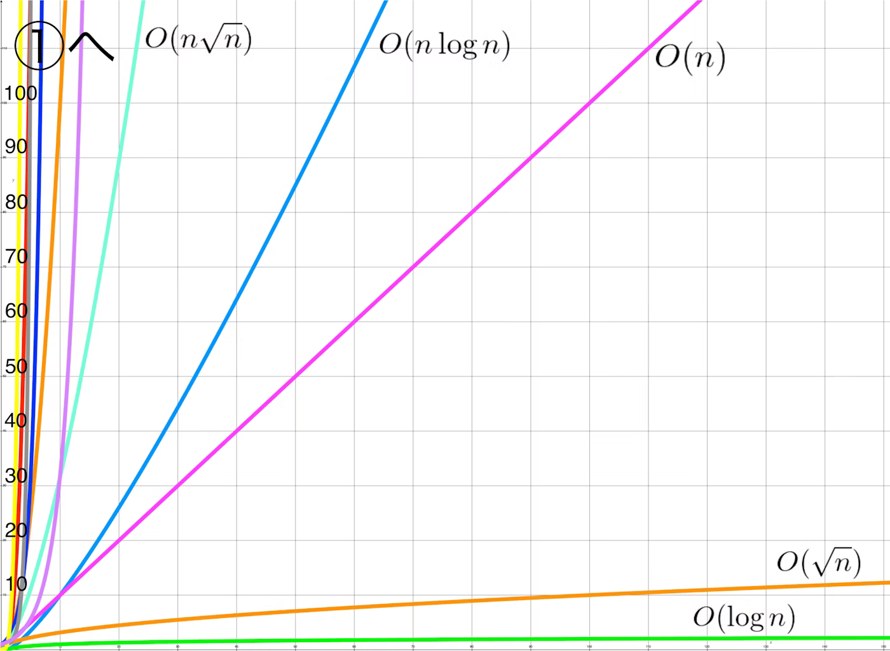
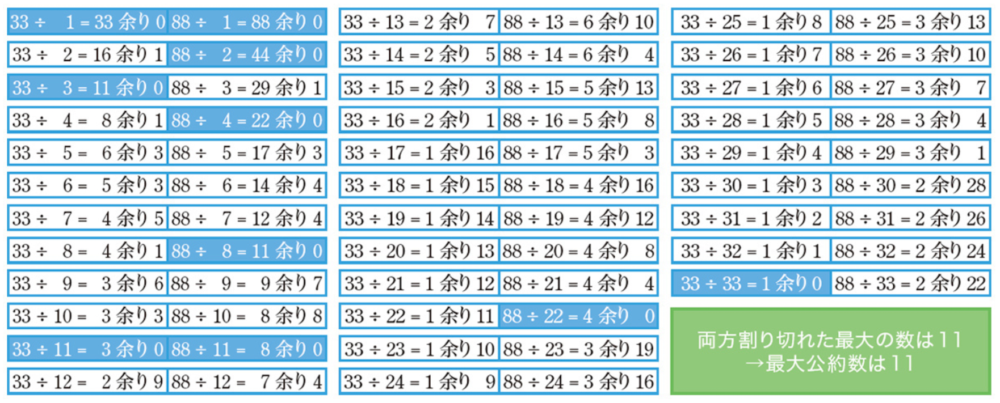
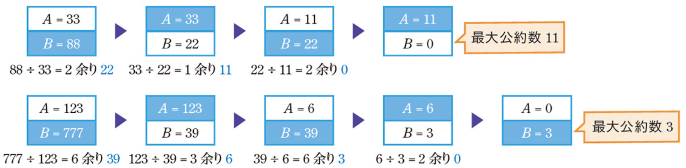
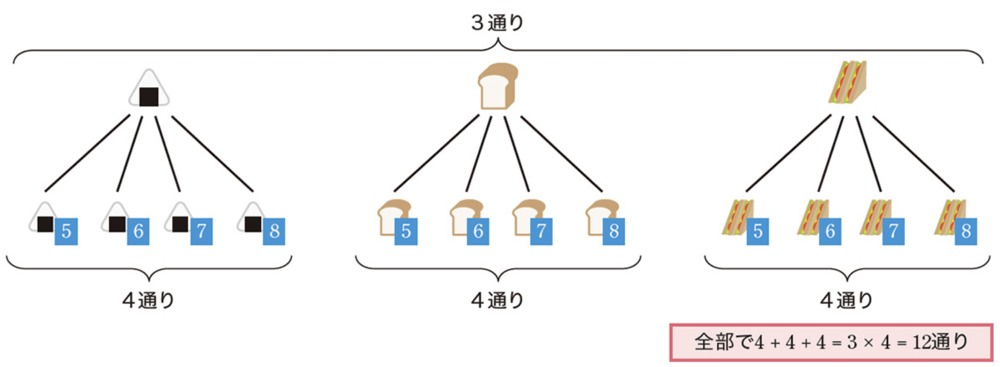
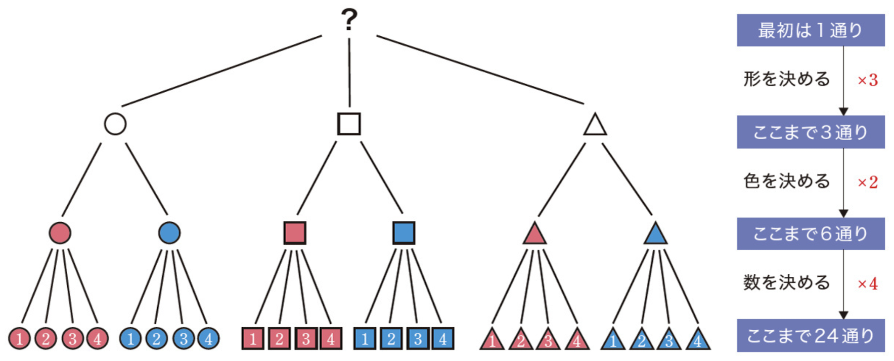
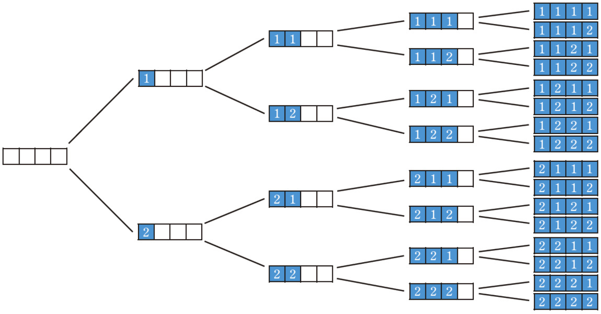
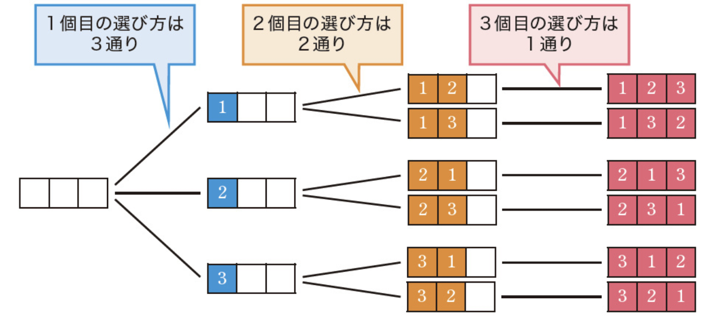

# プログラミング実習

## 第8回：簡単なアルゴリズム

清水 哲也（ shimizu@info.shonan-it.ac.jp ）

---

# 今回の授業内容

- [素数判定法](#素数判定法)
- [ユークリッドの互除法](#ユークリッドの互除法)
- [場合の数とアルゴリズム](#場合の数とアルゴリズム)
- [課題](#課題)

今回の授業内容は以下の本の内容を抜粋しました

[問題解決のための「アルゴリズム×数学」が基礎からしっかり身につく本](https://gihyo.jp/book/2022/978-4-297-12521-9)

---

<div Align=center>

# 前回の課題の解答例

</div>

---

# 前回の課題の解答例

SAの学生さんによる解答例です．
https://shimizu-lab.notion.site/2024-11826a533567807390dcfa0a5e288e15?pvs=4

---

<div Align=center>

# 素数判定法

</div>

---

# 素数判定法

自然数 $N$ が素数であるかどうかを判定する問題を扱います
素数判定法はいろんなアルゴリズムがありますがここでは以下の２つを紹介します

- 単純な素数判定法
- 高速な素数判定法

---

# 単純な素数判定法

例：$53$ が素数であるかを判定してみましょう

- とても単純な方法を考えると $2$ から $52$ まで割り切れるかどうかを調べる方法があります
- デメリットとしては計算に時間がかかってします
- 一般の整数 $N$ についても同じように $2$ から $N-1$ まで割り切れるかどうかをしらべることで素数判定を行うことができます
- このアルゴリズムの計算量は $O(N)$ になりかなり時間がかかります

---

# 単純な素数判定法

 例：$53$ が素数であるかを判定してみましょう

<div Align=center>



</div>

---

# 単純な素数判定法

```java
static boolean isPrime(int N) {
    // N を 2以上の整数とし，Nが素数であれば true，素数でなければ false を返す
    for (int i = 2; i <= N - 1; i++) {
        if (N % i == 0)
        return false;
    }
    return true;
}
```

このプログラムは `int`の範囲であれば実行できます
`int` の範囲は -2,147,483,648 〜 2,147,483,647 なので，例えば「2147483647」の素数判定をしてみましょう
これぐらいの数であればほぼタイムラグなく実行できます

---

# javaで扱える整数型

javaで扱える整数型は以下の4種類があります

<div Align=center>

| データ型 | ビット数 |                        値                         |
| -------- | -------- | ------------------------------------------------- |
| `byte`   | 8 bit    | -128 - 127 (3桁)                                  |
| `short`  | 16 bit   | -32768 - 32767 (5桁)                              |
| `int`    | 32 bit   | -2147483648 - 2147483647 (10桁)                   |
| `long`   | 64 bit   | -9223372036854775808 - 9223372036854775807 (19桁) |

</div>

より大きい整数を扱うためにはデータ型を `int` から `long` に変更する必要があります
試しに「67280421310721」の素数判定を後でやってみてください
すぐに終わらないので注意！！

---

# 高速な素数判定法

単純な素数判定法は $2$ から $N-1$ まで全部を調べているため $N$ が大きくなるとその分計算に時間がかかってしまう
実は $2$ から $N-1$ まで全部を調べる必要はなく $2$ から $\sqrt{N}$ まで調べて割り切れなければ $N$ は素数だと言えます
これが正しいことを示すのは省略します

---

# 高速な素数判定法

例えば53の場合 $\sqrt{53} = 7.28 \cdots$ なので$2, 3, 4, 5, 6, 7$ までで割り切れなければ「**$53$ は素数**」といえます

例えば77の場合 $\sqrt{77} = 8.77 \cdots$ なので$2, 3, 4, 5, 6, 7, 8$ まで調べますが，$7$ で割り切れるので「**$77$は合成数**」といえます

<div Align=center>



</div>

---

# 高速な素数判定法

このアルゴリズムの計算量は $O(\sqrt{N})$ となり，$O(N)$ 比較したグラフを示します

<div Align=center>



https://qiita.com/kokorinosoba/items/1c7400ca6c740fe9f1ee
</div>

---

# 高速な素数判定法

この方法をプログラムにしてみましょう

```java
static boolean isPrime(long N) {
    // N を 2以上の整数とし，Nが素数であれば true，素数でなければ false を返す
    for( long i = 2; i * i <= N; i++) {
        if(N % i == 0) return false;
    }
    return true;
}
```

このプログラムであれば，「67280421310721」の素数判定法も計算時間がわずか数十ms程度になるとおもいます

---

<div Align=center>

# ユークリッドの互除法

</div>

---

# ユークリッドの互除法

自然数 $A$ と $B$ の最大公約数を求める問題を扱います
素数判定法と同様に2種類のアルゴリズムを実装してみます

- 単純なアルゴリズム
- 効率的なアルゴリズム：ユークリッドの互除法

ユークリッドの互除法を利用すると計算量は $O(\log(A+B))$ となります


---

# 単純なアルゴリズム

$33$ と $88$ の最大公約数を計算してみましょう
ここで明らかなことは，答えが $33$ 以下になることです
この条件を利用して単純なアルゴリズムは $1$ から $33$ までの数を使って，$33$ と $88$ 両方が割り切れるかどうかを調べる方法とします

<div Align=center>



</div>

---

# 単純なアルゴリズム

```java
  // 正の整数AとBの最大公約数を返すメソッド
  // GCDはGreatest Common Divisor（最大公約数）の略
  static long GCD(long A, long B) {
    long Answer = 0;

    for (long i = 1; i <= Math.min(A, B); i++) {
      if (A % i == 0 && B % i == 0) {
        Answer = i;
      }
    }
    return Answer;
  }
```

ここで `Math.min(A,B)` は$A$ と $B$ のうち小さい値を返すメソッドです
このプログラムでは余りの計算を$2 \times \min(A, B)$ 回行う必要があり，あまり効率的ではありません
100000000000と123450000000で試してみてください

---

# 効率的なアルゴリズム：ユークリッドの互除法

以下の方法を利用すると2つの正整数の最大公約数を高速に計算することができます

> 1. 大きいほうの数を「大きいほうを小さいほうで割った余り」に書き換えるという操作を繰り返す
> 2. 片方が0になったら操作を終了する．もう片方の数が最大公約数である

---

# 効率的なアルゴリズム：ユークリッドの互除法

この方法で $33$ と $88$ の最大公約数， $123$ と $777$ の最大公約数をそれぞれ計算すると以下のようになります

<div Align=center>



</div>

このアルゴリズムを **ユークリッドの互除法** といいます
$A$ と $B$ の最大公約数を求めるときの計算量は $O(\log(A + B))$ であるため，$A,B$ が $10^{18}$ 程度であってもある程度一瞬で計算できます

---

# 効率的なアルゴリズム：ユークリッドの互除法

```java
static long EuclideanGCD(long A, long B) {
  while (A >= 1 && B >= 1) {
    if (A < B) {
      B = B % A; // A < B の場合，大きい方Bを書き換える
    } else {
      A = A % B; // A >= Bの場合，大きい方Aを書き換える
    }
  }
  if (A >= 1) {
    return A;
  }
  return B;
}
```

このプログラムで $A$ と $B$ の大小関係によって行うべき操作が変わるので，`if`文を用いて場合分けを行っています
更に効率的に実装する方法もあります

---

<div Align=center>

# 場合の数とアルゴリズム

</div>

---

# 場合の数とアルゴリズム

ここでは，階乗・二項係数・積の法則など，基本的な場合の数の公式について扱います
- 基本公式1️⃣：積の法則
- 基本公式2️⃣：積の法則の拡張
- 基本公式3️⃣：$n$個のモノを並び替える方法の数は$n!$
- 基本公式4️⃣：$n$ 個のモノから $r$ 個を並べる方法は $_n \mathrm{P}_r$
- 基本公式5️⃣：$n$ 個のモノから $r$ 個を選ぶ方法は $_n \mathrm{C}_r$
- 応用例1️⃣：買い物の方法の数
- 応用例2️⃣：同色カードの組み合わせ

---

# 基本公式1️⃣：積の法則

事象 $A$ の起こり方が $N$ 通り，事象 $B$ の起こり方が $M$ 通りあるとき，事象 $A,B$ の起こり方の組み合わせは全部で $NM (N \times M)$ 通りあります

- 明日の朝食は，おにぎり・食パン・サンドイッチのいずれかである
- 明日の起きる時間は，5:00, 6:00, 7:00, 8:00のいずれかである

朝食を事象 $A$，起床時間を事象 $B$ とすると $3 \times 4 = 12$ 通りとなり，これを**積の法則**といいます

<div Align=center>



</div>

---

# 基本公式2️⃣：積の法則の拡張

**積の法則**は事象が3以上の場合にも拡張することができます

- **形**：円形，四角形，三角形のいずれか
- **色**：赤・青のいずれか
- **記入する数字**：1,2,3,4のいずれか

この場合も組み合わせの数は積の法則どおり $3 \times 2 \times 4 = 24$通りあります

<div Align=center>



</div>

---

# 基本公式2️⃣：積の法則の拡張

選択肢が同じ数（例えば $M$ 通り）の事象が$N$ 個あるような組み合わせの数は
$$
M \times M \times M \times \cdots \times M = M^N
$$

通りあります
例えば，すべての要素が $1$ または $2$ だる長さ $4$ の数列 $A = (A_1, A_2, A_3, A_4)$ の個数は$2^4 = 24$通りです

<div Align=center>



</div>

---

# 基本公式3️⃣：$n$個のモノを並び替える方法の数は$n!$

$n$  個のモノを並び替える方法は 

$$
n! = n \times (n - 1) \times (n - 2) \times \cdot \times 3 \times 2 \times 1
$$

通りあります
例えば，3つの整数$1,2,3$を並び替える方法は$3! = 3 \times 2 \times 1 = 6$通りあります
方法が $3!$ 通りになる理由は以下の樹形図をみるとわかりやすいです

<div Align=center>



</div>

---

<div Align=center>

# 課題

</dvi>

---

# 課題

- 課題はMoodle上にあります
- 課題に書かれている問題に解答するプログラムを作成してください
- 作成したプログラムを実行して問題なく動作しているかを確認してください
- 動作確認が終わったら，プログラムファイル（`filename.java`）をMoodleに提出してください

### 提出期限は **11月18日(月) 20:00** まで