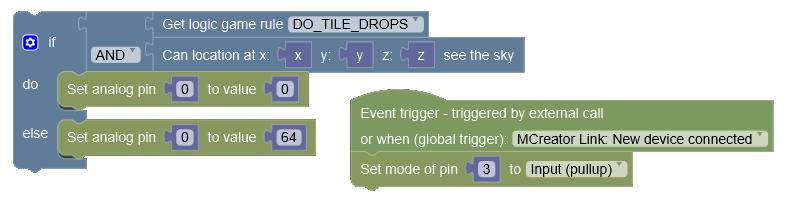
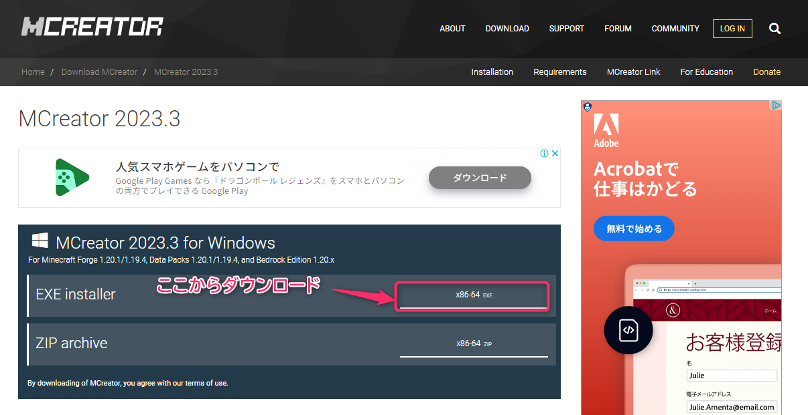

# プログラミング実習

## 第9回：マイクラMOD開発

清水 哲也（ shimizu@info.shonan-it.ac.jp ）

---

# 今回の授業内容

- [前回の課題の解答例](#前回の課題の解答例)
- [MOD開発環境の構築など](#mod開発環境の構築など)
- [チームづくり](#チームづくり)
- [開発計画](#開発計画)
- [課題](#課題)

---

# 前回の課題の解答例

---

# 前回の課題の解答例

SAの学生さんによる解答例です．
https://shimizu-lab.notion.site/2024-11826a533567807390dcfa0a5e288e15?pvs=4

---

# Mod開発環境の構築など

---

# Mod開発環境について（経緯）

マイクラのMod開発環境は色々とありますがほとんどの場合は，マイクラ（Java版）を持っていることが前提ですが，全員がマイクラを持っていない状況なので以下のソフトを使用します

たくさんのクリエイターがMCreatorを使ってMOD等を作成しています
https://mcreator.net/modifications
例：[オルカさん](https://x.com/_orca_san_) アニメ系MOD（鬼滅，呪術廻戦など）

---

# MCreatorとは

MCreatorはオープンソースソフトウェアで，[Minecraft](https://www.minecraft.net/ja-jp/about-minecraft) Java EditionのMOD，[Minecraft](https://www.minecraft.net/ja-jp/about-minecraft) Bedrock EditionのAdd-On，データパックを，直感的に学習できるインターフェイスや統合コードエディタを使って作成できます．世界中のマインクラフトプレイヤーやMOD開発志望者，教育，オンラインクラス，STEMワークショップで使用されています．開発は，スロバキアの[Pylo](https://www.pylo.co/)社が開発していますが完全無料です．

今回採用した一番の理由は，MCreatorには動作確認用にマインクラフトが同梱されていることです．

---

# MCreatorをダウンロード

今回使用するMCreatorのバージョンは **2024.3** です．
以下のサイトからダウンロードできます．
https://mcreator.net/download/2024-3

---

# インストールと使用方法

インストールと使用方法はわかりやすく解説しているサイトがあるのでそちらを参考にします．

https://zenn.dev/nakohama/scraps/c25609377f0539

- MCreatorをインストールします
- 初期設定をします
- 剣の作成をします
- 動作確認をします

---

# 参考サイト

- [公式Wiki](https://mcreator.net/wiki)
- https://kleinsblog.com/tag/mcreator/
- https://elitrashooter.com/%e6%9c%80%e6%96%b0%e3%81%aemcreator%e3%81%ae%e4%bd%bf%e3%81%84%e6%96%b9%e3%81%ae%e3%81%be%e3%81%a8%e3%82%81/
- [Google 検索](https://www.google.com/search?q=mcreator+%E4%BD%BF%E3%81%84%E6%96%B9&oq=mcreator+%E4%BD%BF%E3%81%84%E6%96%B9&gs_lcrp=EgZjaHJvbWUyCQgAEEUYORiABDIGCAEQABgeMggIAhAAGAgYHtIBCTEwMzIwajBqN6gCALACAA&sourceid=chrome&ie=UTF-8)

---

# チームづくり

</dvi>

---

# 開発チームづくり

MOD開発するためのチームづくりをします
チームづくりのルールは以下の通りです
- チームメンバ数：3名 or 4名
- チームリーダーを決める
- チーム名を決める
- 開発方法を決める
  - 基本的にMCreatorを使います
  - 特にMCreator以外を使う場合はチームメンバーのスキルやマイクラの所持，Modの使用経験等を確認してください
  - **マイクラを持っていない学生に購入を強制しないでください**

---

# 開発チームづくり

開発チームができたらGoogle Formsへ**チームリーダー**が報告をしてください
https://forms.gle/vang4oqErWxs9e7S8

## 報告内容
- チーム名
- チームリーダー（学籍番号，氏名）
- チームメンバー（学籍番号，氏名）

### 3名のチームは最後の4名の学籍番号，氏名の報告欄に「0」を記入してください

---

# 開発計画

</dvi>

---

# 開発計画

チーム内でMOD開発について相談してください．
相談する内容は以下の通りです．

- どのようなMODを作るのか（実現可能性は一旦無視）
- 5回の授業でやることの計画（予定でOK）
- 役割分担（予想でOK）

### 次回（11月29日）に開発計画を発表します

---

# 課題

</dvi>

---

# 課題

MCreatorを使って新しいブロックを作成してください．条件は以下の通りです．

- 1人最低1個のブロックを作成してください
- 作成したブロックには最低1つの特殊効果をつけてください
  - 例：ブロックを壊すと爆発するなど
- 作成したブロックの紹介プレゼン資料を作成してください
  - 必ず記入すること
    - ブロックにつけた特殊効果の説明
    - 画像
    - 参考サイト等
  - PDFファイルに変換してMoodleに提出してください

### 提出期限は **11月25日(月) 20:00** まで